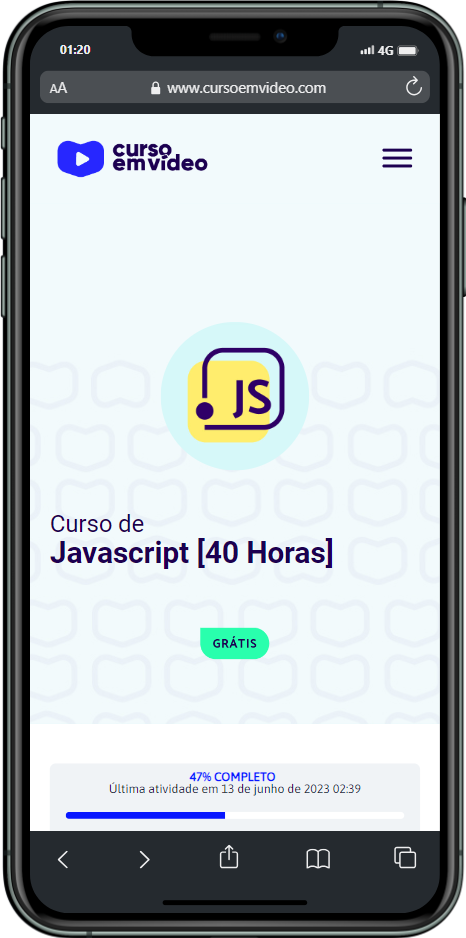
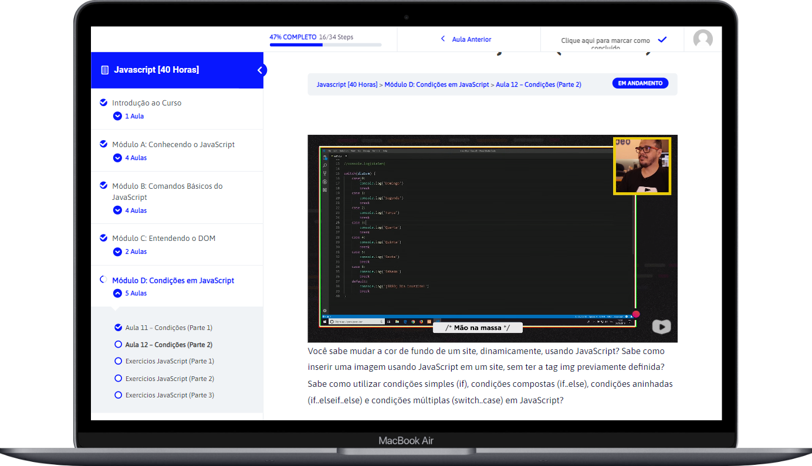

<h1 align="center"> Curso de JavaScript</h1>

 Conteudo utilizado dentro do curso de JavaScript no site <a href="https://cursoemvideo.com">"Curso em vídeo"</a> com o Prof. Gustavo Guanabara. 

  <a href="#-tecnologias">Tecnologias</a>&nbsp;&nbsp;&nbsp;|&nbsp;&nbsp;&nbsp;
  <a href="#-projeto">Projeto</a>&nbsp;&nbsp;&nbsp;|&nbsp;&nbsp;&nbsp;
  <a href="#-layout">Layout</a>&nbsp;&nbsp;&nbsp;|&nbsp;&nbsp;&nbsp;
  <a href="#memo-licença">Licença</a>

  

 

  

    <!--<a target="_blank" href="https://robertojunnior.github.io/javaScript-cev/"> -->
    
     
    </a>
  

 
 
 

## 🚀 Tecnologias

Esse projeto está sendo desenvolvido com as seguintes tecnologias:

<li> HTML
<li> CSS
<li> JavaScript
<li> GitHub

## 💻 Projeto

Com o uso do VSCODE e NODEJS, este curso de linguagem JavaScript é voltado para iniciantes e para quem quiser aprender mais sobre ECMAScript, a versão padronizada do JS.
  
Em um curso patrocinado pelo Google, o professor Gustavo Guanabara ensina o conteúdo básico em 6 módulos que vão desde o conhecimento da linguagem até o uso de funções. 
  
Simplesmente Fantástico e gratuito. 😁🚀

## 🔖 Layout

Todo conteúdo do Curso foi desenvolvido pelo site "Curso em vídeo" com patrocínio do GOOGLE.

## :memo: Licença

Esse projeto está sob a licença MIT.

---

Feito com ♥ by Roberto Junior 😁:wave: 
 🧑‍🚀[Inscreva-se no canal do YouTube da Curso em Vídeo!](https://www.youtube.com/@CursoEmVideo)

    
<h4> Obrigado por visitar meu Git e se chegou até aqui dê um "Follow" que retribuo, quem sabe não podemos colaborar em algum projeto juntos? 
 
 To the next! 🚀🧑‍🚀👽😁🖖.
